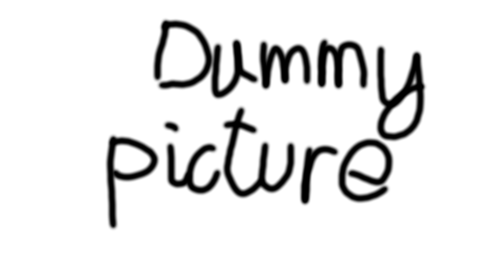

Example of an image:

The same image but using an explicit size of 360x360 pixels:

{:height="360px" width="360px" style="display:block; margin-left:auto; margin-right:auto"}

Link to [second page](second.md).
